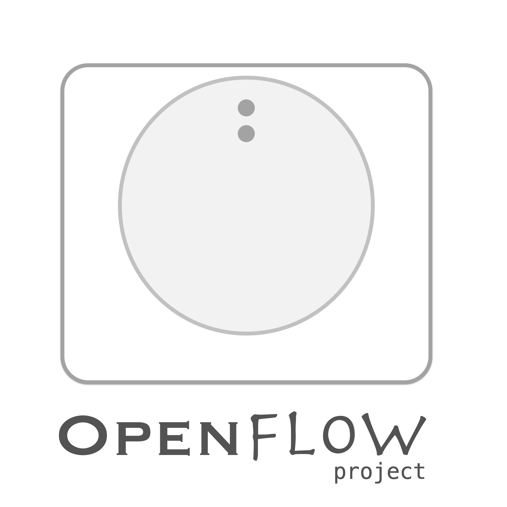
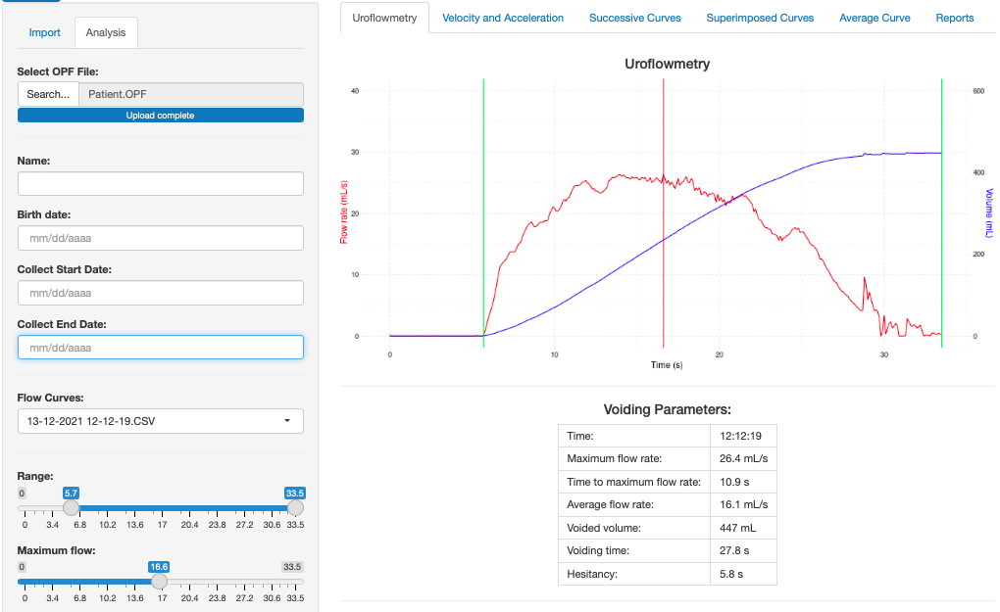
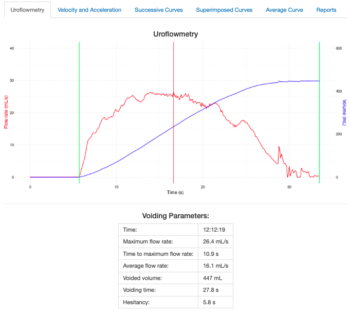
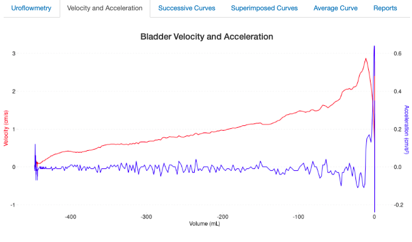
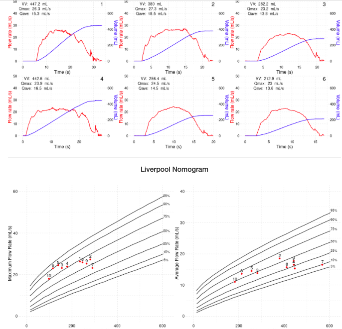
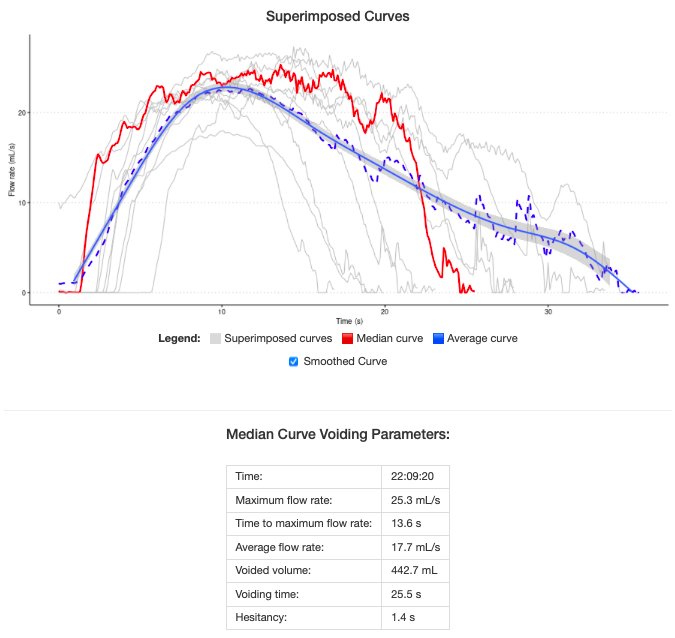

# OpenFlow

OpenFlow Portable Uroflowmetry.

Good news!

These are the latest project files version:

- Mark 4 prototype for 3D printing (dec/2021);
- Arduino sketch code version 2.17;
- Schematic drawing.

# New!

## Shiny Analysis Tools App v1.30
 
Access link: 

https://germanogallo.shinyapps.io/openflowApp/

### Features:

* English/Portuguese languages;
* Import and edit flow curves;
* Create single patient analysis file;
* Single and multiple curve visualization;
* Automatic generation of voiding parameters;
* Bladder velocity and acceleration graph;
* Successive and superimposed curves;
* Smoothed curve;
* Liverpool and Siroky nomograms;
* Create PDF reports.

Enjoy!

#### Main menu

#### Single curve visualization

#### Bladder velocity and acceleration

#### Multiple curves and nomogram

#### Superimposed curves

